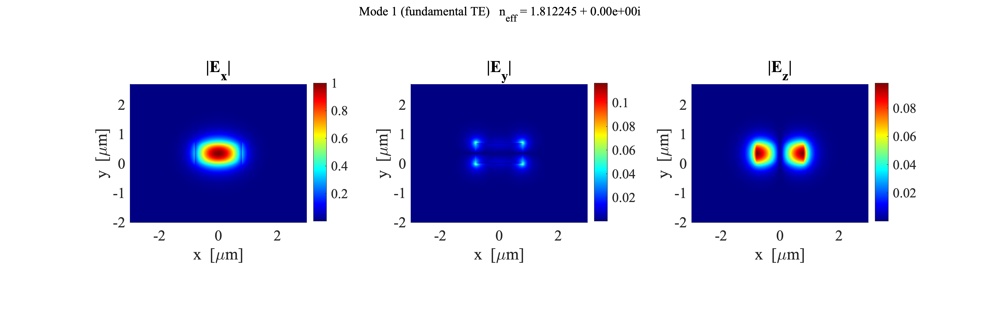
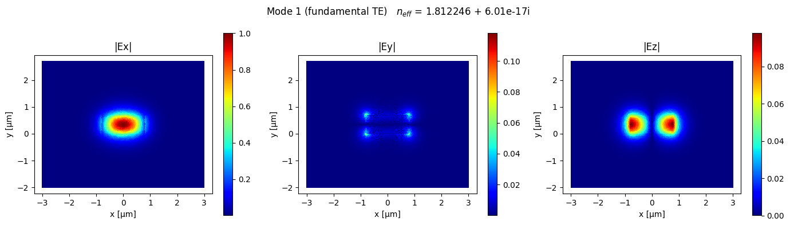

# Full-Vectorial FEM Waveguide Mode Solver

A self-contained Python implementation of a full-vectorial finite element method (FEM) solver for computing guided modes in dielectric optical waveguides. Originally written in MATLAB and ported to Python using NumPy, SciPy, and Matplotlib — no commercial toolboxes or external mesh generators required.

The default test case models a **Si₃N₄** (silicon nitride) waveguide surrounded by SiO₂ at λ = 1.55 µm, but the solver is geometry- and material-agnostic.

---
## MATLAB OUTPUT EXAMPLE


## PYTHON OUTPUT EXAMPLE


## Features

- **Full-vectorial formulation** using a mixed Nedelec (edge) + Lagrange (nodal) element basis, resolving all three components of the electric field (Ex, Ey, Ez)
- **Built-in mesh generator** — seeds a Delaunay triangulation with dense interface points to respect material boundaries; no external mesher needed
- **Sellmeier dispersion models** for SiO₂, Si₃N₄, LiNbO₃ (undoped and doped), including electro-optic correction for LN
- **Shift-invert sparse eigensolver** via `scipy.sparse.linalg.eigs` for efficient extraction of guided modes near a target effective index
- **TE/TM fraction** computed by quadrature-weighted energy decomposition
- **Mode overlap integrals** for orthogonality checks and coupling coefficient estimation
- **Publication-quality field plots** of |Ex|, |Ey|, |Ez| saved as PNG

---

## Physics

The solver finds propagating modes of the form **E**(x, y) e^(iβz) by casting Maxwell's equations in the 2D cross-section as a generalized sparse eigenvalue problem:

```
A · x = λ · B · x,   λ = β² / k₀²,   n_eff = β / k₀
```

The weak form uses lowest-order mixed elements:

- **Edge (Nedelec) DOFs** for the transverse field **E**_t, enforcing the correct tangential continuity across dielectric interfaces and suppressing spurious modes
- **Nodal (Lagrange P1) DOFs** for the longitudinal component E_z

Gaussian quadrature (3-point, exact to degree 2) is used for all element matrix integrals.

---

## Waveguide Cross-Section

```
        ←——————— w_sim ————————→
  yT ┌──────────────────────────┐
     │         cladding         │  h_clad
     │      ┌──────────┐        │
     │      │   core   │        │  h_core
  y=0│──────┴──────────┴────────│
     │           BOX            │  h_box
  yB └──────────────────────────┘
        ←— w_core —→
```

All lengths are in micrometres. Permittivity is assigned per element centroid based on which region it falls in.

---

## Installation

```bash
pip install numpy scipy matplotlib
```

Python 3.8+ is required. No other dependencies.

---

## Quick Start

```bash
python waveguide_fem_solver.py
```

This runs the default Si₃N₄ test case (w = 1.6 µm, h = 0.7 µm, λ = 1.55 µm) and:

1. Builds the triangular mesh
2. Solves for 6 guided modes
3. Prints effective indices and TE fractions to the terminal
4. Saves field plots (`Mode_1_fundamental_TE.png`, etc.) to the working directory

### Example terminal output

```
n_core (Si3N4) = 1.996408
n_clad (SiO2)  = 1.444022
Building mesh ...
  Mesh: 4231 nodes, 8318 elems  (core=412, box=1876, clad=6030)
Nodes: 4231,  Elements: 8318
Assembling & solving eigenvalue problem ...
  DOFs: 12549 edge (Et) + 4231 nodal (Ez) = 16780 total
  Running eigs (k=6, sigma=15.8732) ...

--- Guided modes ---
Mode 1:  n_eff = 1.724503 + 0.00e+00i,  TE-frac = 0.971
Mode 2:  n_eff = 1.608217 + 0.00e+00i,  TE-frac = 0.043
Mode 3:  n_eff = 1.531884 + 0.00e+00i,  TE-frac = 0.918
...
```

---

## Using as a Library

```python
from waveguide_fem_solver import (
    get_refractive_index,
    build_soi_mesh,
    compute_modes,
    plot_mode_fields,
    calculate_overlap,
)

# Material indices
n_core = get_refractive_index('Si3N4', 1.55)
n_clad = get_refractive_index('SiO2',  1.55)

# Build mesh
nodes, elems, epsilon_r, regions = build_soi_mesh(
    w_core=0.9, h_core=0.22, h_clad=2.0, h_box=2.0, w_sim=4.0,
    n_core=n_core, n_clad=n_clad, n_box=n_clad, mesh_res=300,
)

# Solve
modes = compute_modes(nodes, elems, epsilon_r, wavelength=1.55, num_modes=4)

# Inspect
for i, m in enumerate(modes):
    print(f"Mode {i+1}: n_eff = {m['n_eff']:.6f}, TE = {m['te_fraction']:.3f}")

# Plot
plot_mode_fields(modes[0], nodes, elems, 'Fundamental TE')

# Overlap between mode 0 and mode 1
ol = calculate_overlap(modes[0], modes[1])
print(f"Overlap <0|1> = {ol:.4e}")
```

---

## Supported Materials

| Key | Material | Model |
|---|---|---|
| `'SiO2'` | Fused silica | Sellmeier (3-term) |
| `'Si3N4'` | Silicon nitride | Sellmeier (Lipson, 2-term) |
| `'LN'` | LiNbO₃ (undoped) | Sellmeier + EO correction (γ₁₃, γ₃₃) |
| `'LNdoped'` | LiNbO₃ (doped) | Sellmeier (modified coefficients) |

Wavelength can be passed in metres or microns — the functions auto-detect the unit. For LN materials, pass `mode='even'` (extraordinary, default) or `mode='odd'` (ordinary), and optionally an applied field `Ez` in V/m.

---

## Configuration Options

`compute_modes()` accepts the following keyword arguments:

| Parameter | Default | Description |
|---|---|---|
| `num_modes` | `4` | Number of modes to extract |
| `mu_r` | `1.0` | Relative permeability |
| `n_guess` | `None` | Starting n_eff for shift-invert (auto if None) |
| `metallic_boundaries` | `False` | PEC walls (True) or open Ez=0 boundary (False) |

In `main()`, set `plot_mesh = True` to visualise the mesh permittivity map, and `compute_overlaps = True` to compute and display the N×N overlap matrix.

---

## File Structure

```
waveguide_fem_solver.py   # Everything: mesh, solver, materials, plotting
README.md
```

The solver is intentionally kept as a single file for portability and ease of embedding in notebooks or larger simulation pipelines.

---

## Limitations and Known Issues

- **Mesh quality**: The built-in mesher uses `scipy.spatial.Delaunay` with strategic seed-point placement to approximate material interface conformity. It does not enforce hard constraints on the triangulation. For high-accuracy work, replacing this with a constrained Delaunay mesher (e.g., the [`triangle`](https://rufat.be/triangle/) package) is recommended.
- **Leaky modes**: The open boundary condition (Ez = 0 on outer nodes) is a simple first-order truncation. PML (perfectly matched layer) is not yet implemented, so lossy or leaky modes may not be accurate.
- **Performance**: The element loop is pure Python. For large meshes the assembly step is the bottleneck; vectorizing it with NumPy broadcasting would give a significant speedup.

---

## References

The mixed-element FEM formulation follows the approach described in:
- J. . -F. Lee, "Finite element analysis of lossy dielectric waveguides," *IEEE Trans. Microwave Theory Tech.*, vol. 42, no. 6, pp. 1025-1031, June 1994, doi: 10.1109/22.293572
- Koshiba & Inoue, "Simple and efficient finite-element analysis of microwave and optical waveguides," *IEEE Trans. Microwave Theory Tech.*, 1992.
- Sellmeier coefficients for Si₃N₄: Luke et al., *Opt. Lett.* 40, 4823 (2015).
- Sellmeier coefficients for SiO₂: Malitson, *JOSA* 55, 1205 (1965).
- Sellmeier and EO coefficients for LiNbO₃: Zelmon et al., *JOSA B* 14, 3319 (1997).
